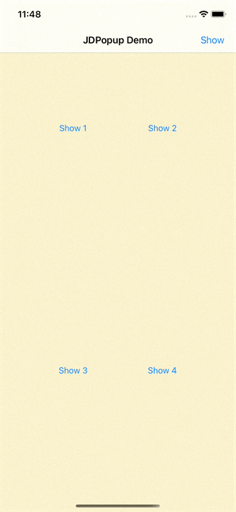

# JDPopup
[JDPopup](https://github.com/jdleung/JDPopup) is a light weight  popup container for `iOS`. It shows a popup view with an arrow that indicates the sender's position.

## SreenShots



## Installation


### CocoaPod:

```ruby
pod 'JDPopup'
```

## Usage

### Customization


| config |
| :------ |
| customWidth |
| customHeight |
| arrowWidth |
| arrowHeight |
| barTitleColor |
| contentBgColor |
| borderColor |
| borderWidth |
| backgoundColor |
| cornerRadius |
| barHeight |
| tapScreenClose |
| lrSpacing |
| tbSpacing |
| duration |
| globalShadow |
| shadowAlpha |
| exitBtnTintColor |
| exitBtnImage |

### Create an instance of JDPopup

#### Sender UIButton

```swift
func showPopup(_ sender: UIButton) {  
    let imageView = UIImageView()
    imageView.image = UIImage(named: "tree")
  
    let popView = JDPopup(sender: sender, barTitle: "A Popup Image View", contentViewAdapter: { contentView in
                imageView.frame = CGRect(x: 0, y: 0, width: contentView.frame.width, height: contentView.frame.height)
                contentView.addSubview(imageView)
            })
    popView.config.customHeight = 300.0
    popView.present()
}
```

#### Sender UIBarButtonItem

```swift
func showPopup(_ sender: UIBarButtonItem, event: UIEvent) {
    let imageView = UIImageView()
    imageView.image = UIImage(named: "tree")
  
    let popView = JDPopup(event: event, barTitle: "A Popup Image View", contentViewAdapter: { contentView in
                imageView.frame = CGRect(x: 0, y: 0, width: contentView.frame.width, height: contentView.frame.height)
                contentView.addSubview(imageView)
            })
    popView.config.customHeight = 300.0
    popView.present()
}
```


## License

JDPopup is available under the `MIT` license. See the `LICENSE` file for more info.
