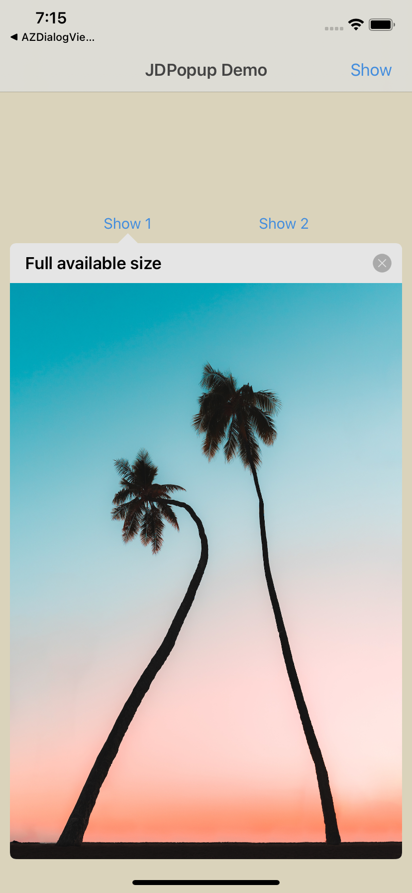
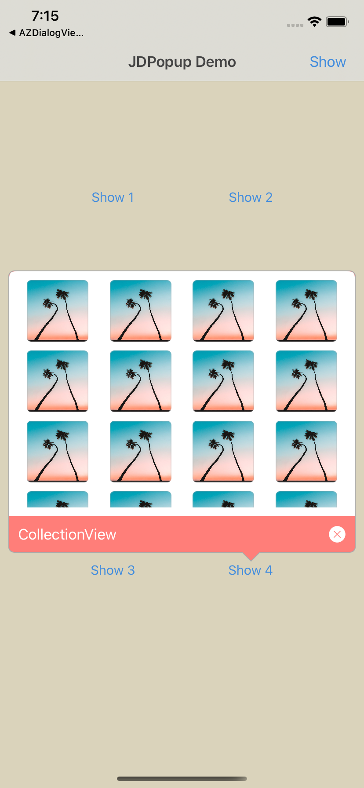
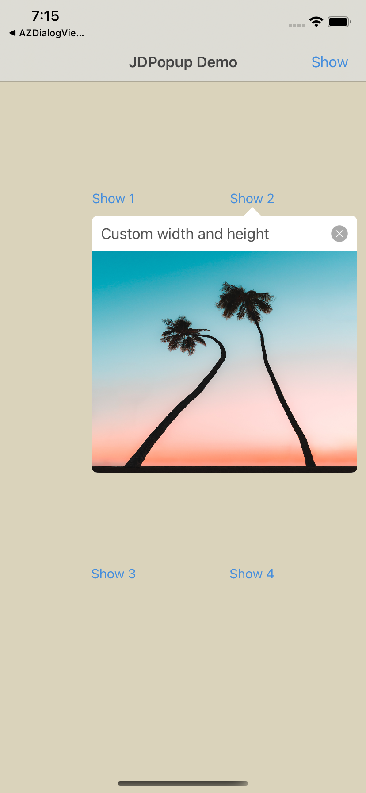

# JDPopup
[JDPopup](https://github.com/jdleung/JDPopup) is a popup container for `iOS`. It shows a popup view with an arrow that indicates the sender point. You can put any type of UIView into it, UILabel, UITableView, UICollecitonView, UITextView... etc. All you need to do is to put them into its API, JDPopup automatically determines showing up on the maximum available height, or you can custom the width and height.

## SreenShots

  

  

## Installation


### CocoaPod:

```ruby
pod 'JDPopup'
```

## Usage

### Customize

```swift
customWidth
customHeight
arrowWidth
arrowHeight
barTitleColor
contentBgColor
borderColor
borderWidth
backgoundColor
cornerRadius
barHeight
tapScreenClose
lrSpacing
duration
globalShadow
shadowAlpha
exitBtnTintColor
exitBtnImage
```

### Create an instance of JDPopup

```swift
let popView = JDPopup(sender: sender, barTitle: "A Popup Image View", contentViewAdapter: { contentView in
            let imageView = UIImageView(frame: CGRect(x: 0, y: 0, width: contentView.frame.width, height: contentView.frame.height)
            imageView.image = UIImage(named: "tree")
            contentView.addSubview(imageView)
        })
popView.config.customHeight = 300.0
popView.present()
```


## License

JDPopup is available under the `MIT` license. See the `LICENSE` file for more info.
